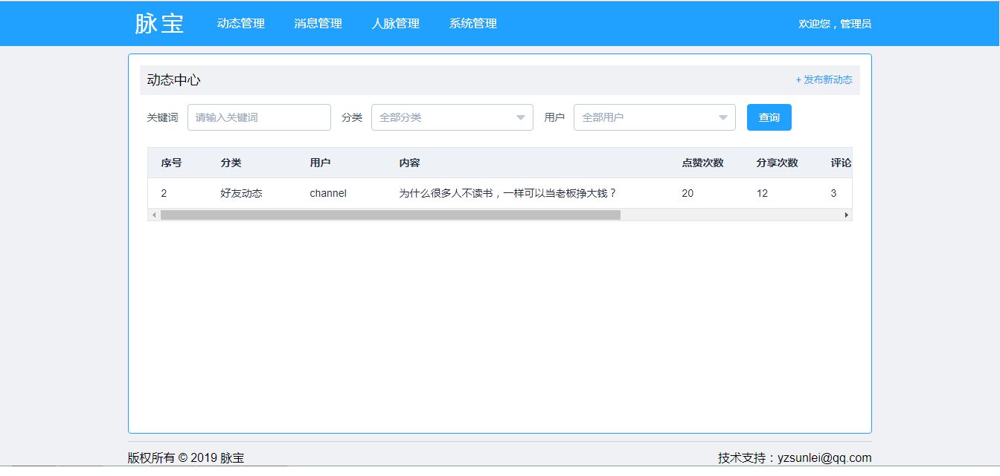

# maibao-admin-web

脉宝App应用的后台管理系统，使用Vue + ElementUI + echart等构建

本项目纯属个人学习研究之作，仅供学习和参考。

持续更新，有兴趣请star一下

## 安装

#### 注意：由于涉及大量的 ES6/7 等新属性，node 需要 6.0 以上版本 
```

git clone https://github.com/yzsunlei/maibao-admin-web.git

cd maibao-admin-web

//这里使用淘宝镜像安装能快一点
npm --registry https://registry.npm.taobao.org install

```
## 运行

### 本地调试模式

```
npm start

```
### 生产模式(部署)

```
npm run build

```

# 项目部分截图



# 主要包含的功能

>>动态管理

>>消息管理

>>人脉管理

>>系统管理


## 相关使用技术链接

- [Vue](https://github.com/vuejs/vue)
- [ElementUI](https://github.com/ElemeFE/element)
- [Vuex](https://github.com/vuejs/vuex)
- [webpack](https://github.com/webpack/webpack)
